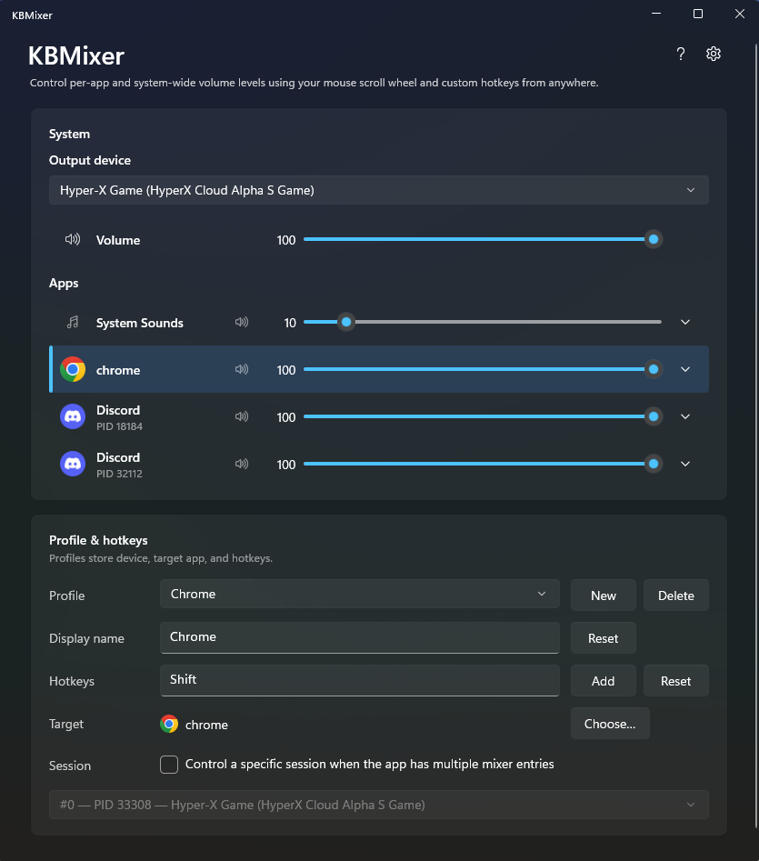

# KBMixer
`KBMixer` allows you to adjust the volume of individual applications on your Windows device using specified global keyboard hotkeys and your mouse scroll wheel without needing to focus a specific volume mixer application.



## Development

KBMixer targets **.NET 8** (`net8.0-windows10.0.19041.0`) and the **Windows App SDK (WinUI 3)**. You need **Windows 10 1903+** and tooling that includes the Windows application development workload.

### Prerequisites

You need the [.NET 8 SDK](https://dotnet.microsoft.com/download/dotnet/8.0) and, for a full IDE experience, [Visual Studio Community](https://visualstudio.microsoft.com/vs/community/) with the **Windows application development** workload.

**Install with [winget](https://learn.microsoft.com/en-us/windows/package-manager/winget/)** (use an elevated PowerShell if a package asks for administrator approval):

```powershell
winget install --id Microsoft.DotNet.SDK.8 -e --source winget
winget install --id Microsoft.VisualStudio.Community -e --source winget
```

After Visual Studio finishes, open **Visual Studio Installer** → **Modify** on your Community install and enable the **Windows application development** workload if the installer did not already select it. That workload includes the Windows App SDK and WinUI 3 project support.

### Build and run

From the repository root (where `KBMixer.sln` lives):

```powershell
dotnet restore KBMixer.sln
dotnet build KBMixer.sln -r win-x64
dotnet run --project KBMixer\KBMixer.csproj -r win-x64
```

## License

This project is licensed under the [MIT License](LICENSE).
